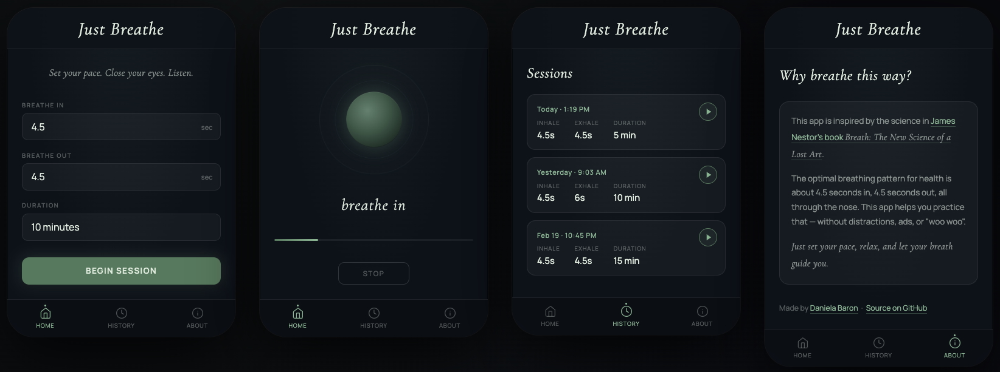

# Just Breathe

*Set your pace. Close your eyes. Listen.*



A minimal, science-backed breathing app inspired by James Nestor's [Breath: The New Science of a Lost Art](https://www.mrjamesnestor.com/breath-book/). No accounts, no ads, no tracking, no upsells — without the "woo woo."

## What it does

- Guides you through breathing cycles
- Lets you customize inhale/exhale duration and total session time
- Uses your device's built-in voice to prompt "Breathe in," "Breathe out," and "All done"
- Keeps your screen awake during sessions so you don't have to touch it
- Tracks your recent sessions so you can repeat what worked

Set your numbers, press Start, put the phone down, and breathe.

[Open on your phone](https://danielabar.github.io/just-breathe/)

## Development

```sh
npm run dev
```

Starts a local server at http://127.0.0.1:8080 with caching disabled. No build step — edit HTML, CSS, or JS and refresh.

## Testing

Unit tests use Vitest and run against the JS modules directly:

```sh
npm test
```

Visual regression tests use Playwright and run against the live app in a browser:

```sh
npm run test:e2e
```

Use `npm run test:e2e:ui` to open the interactive Playwright UI, or `npm run test:e2e:update` to regenerate baseline snapshots after intentional visual changes.

## Tech

Built with plain HTML, CSS, and JavaScript — no frameworks, no build tools, no runtime dependencies. Uses the Web Speech API for voice prompts and the Wake Lock API to keep the screen on during sessions. Runs anywhere, deploys as static files.
