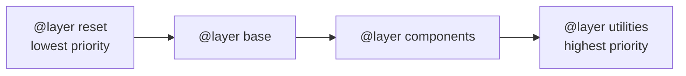

```mermaid
graph TD
    idx["<b>index.css</b>\nentry point"]

    subgraph outside ["Outside all layers"]
        fonts["fonts.css\n@font-face"]
        vars["variables.css\n:root { --color-* --font-* }"]
    end

    subgraph reset_layer ["@layer reset"]
        reset["reset.css"]
    end

    subgraph base_layer ["@layer base"]
        layout["layout.css\nhtml · body · header · main · footer · #app-view"]
    end

    subgraph components_layer ["@layer components"]
        global["global.css\nform container alignment"]
        app["app.css\nview cards · inputs · about view"]
        button["button.css\n.btn base + .btn--primary · --secondary · --replay"]
        history["history.css\nhistory entries · replay btn · empty state"]
        tabbar["tab-bar.css\nbottom tab navigation"]
        session["session.css\nbreathing orb · session screen"]
    end

    idx --> fonts
    idx --> vars
    idx --> reset
    idx --> layout
    idx --> global
    idx --> app
    idx --> button
    idx --> history
    idx --> tabbar
    idx --> session
```

# CSS Architecture

This document explains how the stylesheets in `styles/` are organised, why they
are organised that way, and where to put new CSS when you add features.

> **Inspiration:** This architecture is modelled on
> [csscaffold by robzolkos](https://github.com/robzolkos/csscaffold), which
> demonstrates using CSS cascade layers to build a predictable, maintainable
> stylesheet structure without any build tools.

---

## The problem this solves

CSS written without a structure tends to develop specificity wars. Two rules
targeting the same element fight over which one wins, and the answer depends
on selector complexity — adding a class here, a nesting level there — until
nobody is confident that changing one rule won't break something unrelated.

This project previously had that problem: the same rules were duplicated across
three files, colours were hardcoded in multiple places, and button styles had
four independent implementations with no shared base.

The solution is **CSS cascade layers**.

---

## How cascade layers work

The `@layer` declaration creates named buckets for styles. The order they are
declared determines their priority — **later layers always win**, regardless of
selector specificity:

```css
@layer reset, base, components, utilities;
```



This means a low-specificity utility class (`.hidden`) will always override a
high-specificity component rule (`nav ul li a.active`) if utilities are declared
after components. You never need to reach for `!important` or artificially inflate
selector specificity to make something win — just put it in the right layer.

> **Note:** Any CSS written *outside* a `@layer` block is treated as higher
> priority than all named layers. In this project, `variables.css` and
> `fonts.css` are intentionally outside layers for reasons explained below.

---

## File structure

```
styles/
  index.css       ← entry point: layer declaration + all imports (nothing else)
  fonts.css       ← @font-face declarations            [outside layers]
  variables.css   ← CSS custom properties (:root)      [outside layers]
  reset.css       ← browser normalisation               [@layer reset]
  layout.css      ← page structure                      [@layer base]
  global.css      ← form container alignment            [@layer components]
  app.css         ← view cards, form inputs, about view [@layer components]
  button.css      ← button base class + all variants    [@layer components]
  history.css     ← history entries, replay btn         [@layer components]
  tab-bar.css     ← bottom tab navigation               [@layer components]
  session.css     ← breathing orb, session screen       [@layer components]
```



---

## The entry point: `styles/index.css`

```css
@layer reset, base, components, utilities;

@import './fonts.css';
@import './variables.css';
@import './reset.css';
@import './layout.css';
@import './global.css';
@import './app.css';
@import './button.css';
@import './history.css';
@import './tab-bar.css';
@import './session.css';
```

This file does exactly two things: declares the layer order and imports every
other stylesheet. **It contains no rules of its own.**

The import order matters:

1. `fonts.css` first — font faces must be registered before anything uses them
2. `variables.css` second — custom properties must exist before `reset.css`
   references them (`var(--color-bg)` etc.)
3. Everything else — order within the same layer doesn't affect priority, but
   keeping it consistent (reset → base → components) is easier to reason about

---

## Design tokens: `variables.css`

All colours, font stacks, and shared values live here as CSS custom properties
on `:root`. This is the **single source of truth** for the visual theme.

```css
:root {
  --font-main: 'Manrope', system-ui, sans-serif;
  --color-bg: #0c1219;
  --color-accent: #7db891;
  /* ... */
}
```

**Rules:**
- Never write a hardcoded hex colour in a component file — use `var(--color-*)`.
- When adding a new colour, add it here first, then reference it by name.
- Changing the entire colour theme means editing one file, and the change
  propagates everywhere automatically.

`variables.css` is outside all `@layer` blocks because CSS custom properties
on `:root` are resolved at paint time, not cascade time — but keeping them
outside layers makes the intent clear: these are global constants, not styles
that compete with anything.

---

## Why `fonts.css` is outside layers

`@font-face` declarations are not part of the cascade in the normal sense — they
register a font family name for later use. Placing them inside a `@layer` block
is technically valid but serves no purpose and can cause subtle loading issues
in some browsers. Keep them outside.

---

## The button system: `button.css`

All buttons in the app share a base class with variants:

```css
/* Base — every button gets this */
.btn { ... }

/* Variants — added alongside .btn */
.btn--primary   { /* solid accent, main CTA */ }
.btn--secondary { /* ghost/outlined, secondary action */ }
.btn--replay    { /* small circular icon button, history entries */ }
```

Usage in HTML/JS templates:

```html
<button class="btn btn--primary">Start</button>
<button class="btn btn--secondary">Stop</button>
```

**Rule:** Every new button type gets a new `.btn--variant` class added to
`button.css`. Never style a button from scratch in a component file — always
start from `.btn`.

---

## The reset: `reset.css`

A modern reset (based on Basecamp's
[Fizzy](https://github.com/basecamp/fizzy) and Andy Bell's
[modern-css-reset](https://github.com/hankchizljaw/modern-css-reset)) that:

- Sets `box-sizing: border-box` universally — no element uses `content-box`
- Makes images block-level with `max-inline-size: 100%`
- Inherits fonts into `input`, `button`, `textarea`, `select`
- Handles `prefers-reduced-motion` globally — all animations and transitions
  are suppressed for users who have opted out of motion

**Don't touch this file** unless updating the reset itself. Component-specific
resets belong in component files.

---

## How to add new CSS

### New colour, spacing value, or font

Add it to `variables.css` as a custom property. Reference it everywhere else
via `var(--your-property-name)`.

```css
/* variables.css */
:root {
  --color-new-thing: #abc123;
}
```

### New page-level layout change

Edit `layout.css`, which is in `@layer base`. This file owns `html`, `body`,
`header`, `main`, `footer`, and `#app-view`.

### New UI component (new view, new widget)

Create a new file in `styles/` and wrap it in `@layer components`:

```css
/* styles/my-component.css */
@layer components {
  .my-component { ... }
}
```

Then add a single `@import` line to `styles/index.css`. That's it — the layer
system handles the rest.

### New button type

Add a `.btn--variant` to `button.css`. Don't create a freestanding button style
anywhere else.

```css
/* button.css */
.btn--tab {
  /* tab bar button variant */
}
.btn--tab.is-active {
  color: var(--color-accent);
}
```

### New utility class

Add it to `utilities.css` (create the file if it doesn't exist yet) wrapped in
`@layer utilities`. Because `utilities` is declared last in the layer order, a
utility class will override any component style without needing `!important`.

```css
/* styles/utilities.css */
@layer utilities {
  .visually-hidden {
    position: absolute;
    width: 1px;
    height: 1px;
    overflow: hidden;
    clip: rect(0 0 0 0);
  }
}
```

---

## What not to do

| Don't | Do instead |
|-------|-----------|
| Write `color: #3a7c7c` in a component file | Use `var(--color-accent-dark)` |
| Write `width: 100vw` | Use `width: 100%` |
| Add styles directly to `index.css` | Add a new file and import it |
| Write a new button with its own `.my-btn { border-radius: ... }` | Add `.btn--my-btn` to `button.css` |
| Use `!important` to override a component style | Move the rule to a higher-priority layer |
| Duplicate a rule from one component file into another | Extract a shared variable or a shared base class |
| Put styles outside a `@layer` block (except in `variables.css` and `fonts.css`) | Wrap them in the appropriate layer |
